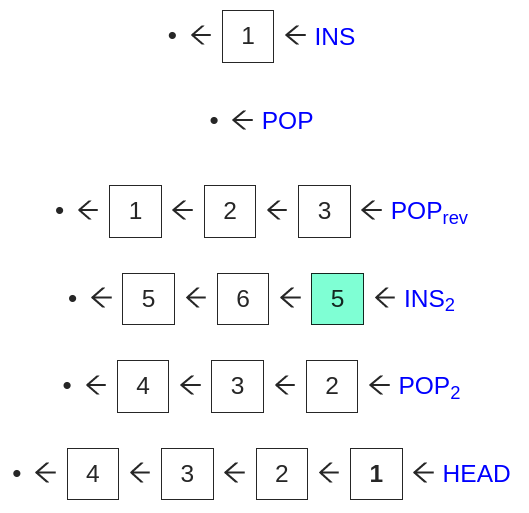

# Functional Queue Visualization

This project is a visualization of a purely functional queue data structure,
implemented enqueue and dequeue operations in constant worst-case time using
six stacks.

## [Demo](https://6851-2021.github.io/functional-queue-visualization/)

[Run the visualization in your browser!](https://6851-2021.github.io/functional-queue-visualization/)

## Setup instructions

First, make sure Node.js and `npm` (and optionally `yarn`) are installed (https://www.npmjs.com/get-npm).

Once the repository is cloned/downloaded, navigate to the `/app` directory, run `npm install` (or `yarn`) to install any package dependencies, and then run `npm start` (or `yarn start`) to launch the application. The app should open at `localhost:3000` in your browser.

## Documentation

[`writeups/writeup.pdf`](writeups/writeup.pdf) is a writeup on the design of the functional queue visualizer.

[`writeups/functional.pdf`](writeups/functional.pdf) describes the specifics of our functional queue implementation.

## Brief Introduction to Functional Queues

### Functional data structures

A functional data structure can never be modified. Instead, when performing an operation, a new copy of the data structure is returned. This implies a property called full persistence: previous versions of the data structure remain accessible forever, and we can perform operations on any version we choose.

### A simple example: functional stacks

A functional stack is probably the simplest example of a functional data structure. It consists solely of a pointer to the head of a one-way linked list, which contains the stack’s elements from top to bottom. To push, we add a new element to the one-way linked list, and return the pointer to this new element. To pop, we return a pointer to the second element of the linked list.

### What about a functional queue?

Functional queues are a natural next step. Ideally, we would like to implement them with a constant number of changes per enqueue/dequeue. This turns out to be much harder than for stacks! But there is a solution: using our functional stacks as a black box, we can simulate each queue operation using a constant number of operations on a set of six stacks. The primary goal of our visualizer is to show these operations in action, and how they come together to make a functional queue.
